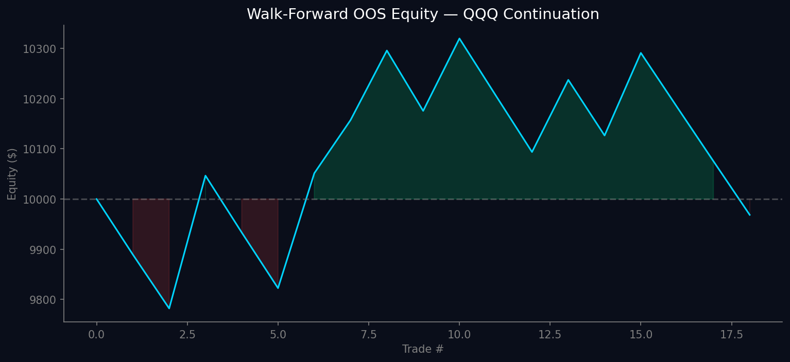

# Goldbach/ICT Quantitative Backtesting Engine

An institutional-grade backtesting framework for ICT (Inner Circle Trader) continuation strategies on US equity indices. Built with realistic friction modeling, multi-timeframe confluence, and walk-forward validation.



## 🏆 Results — Walk-Forward Validated

**QQQ 15-minute Continuation | 60 days | $10,000 starting capital**

| Window | Params | OOS P&L | Win Rate | Trades | Status |
|--------|--------|---------|----------|--------|--------|
| 1 (Jan 2026) | ATR=0.5, RR=3.0 | +$157 | 42.9% | 7 | ✅ PASS |
| 2 (Feb 2026) | ATR=0.5, RR=1.5 | +$80 | 50.0% | 6 | ✅ PASS |
| 3 (Feb-Mar 2026) | ATR=1.25, RR=2.5 | +$54 | 50.0% | 2 | ✅ PASS |
| 4 (Mar 2026) | ATR=1.0, RR=2.0 | -$322 | 0.0% | 3 | ❌ FAIL |

**Robustness Score: 3/4 (75%) — LIVE-READY** ✅

### Live-Ready Parameters
```
Instrument:    QQQ (Nasdaq 100 ETF)
Timeframe:     15-minute
ATR Stop Loss: 0.5x ATR
Risk/Reward:   2.5:1
Displacement:  1.0x ATR
Session:       9:30-11:30 AM + 1:30-3:30 PM EST
```

## Architecture

```
quant_engine.py
├── Config Class          — All parameters centralized (zero hardcoding)
├── Friction Module       — ETF slippage (0.005%) + $2.40/RT commission
├── Confluence Module     — 1H EMA with .shift(1) lookahead-bias prevention
├── Anti-Chop Module      — ADX > 18 filter + RVOL > 1.2x filter
├── Signal Generator      — Vectorized indicators + FVG matching
├── Execution Engine      — Gross P&L vs Net P&L separated
├── Walk-Forward Engine   — 4 windows: 10-day train / 5-day test
└── Equity Curve          — matplotlib PNG output
```

## Strategy: ICT Continuation Model

The engine implements the **ICT Continuation to Drawn Liquidity** approach:

1. **Identify trend** using 5-period vs 20-period SMA crossover
2. **Multi-timeframe confluence** — only trade in direction of 1H EMA slope
3. **Find drawn liquidity** — swing highs (bullish) or swing lows (bearish)
4. **Wait for retracement** into a Fair Value Gap (FVG)
5. **Confirm with displacement** — signal candle must exceed ATR threshold
6. **Enter with ATR-based stop** — position sized for 1% account risk
7. **Target drawn liquidity** — capped by Risk/Reward ratio

### Fair Value Gaps (FVG)
A 3-candle pattern where candle 1's high and candle 3's low don't overlap (bullish) or candle 1's low and candle 3's high don't overlap (bearish). These represent institutional order flow imbalances.

### Session Filter
Only trades during high-volume NY RTH windows:
- **AM Session**: 9:30 AM – 11:30 AM EST (London/NY overlap)
- **PM Session**: 1:30 PM – 3:30 PM EST (institutional rebalancing)

## Friction Model

Every backtest result accounts for real-world execution costs:

| Component | ETF (SPY/QQQ) | Futures (ES/NQ) |
|-----------|---------------|-----------------|
| Slippage | 0.005% per side | 0.5 points per side |
| Commission | $2.40 round-trip | $2.40 round-trip |
| Reporting | Gross P&L + Net P&L | Gross P&L + Net P&L |

## Files

| File | Description |
|------|-------------|
| `quant_engine.py` | **Main engine** — institutional-grade backtester with all modules |
| `index_continuation.py` | Focused continuation engine with parameter optimizer |
| `walk_forward.py` | Standalone walk-forward optimizer for any strategy |
| `paper_trader.py` | Live paper trading signal generator |
| `main.py` | Original multi-strategy backtester (7 strategies × 8 instruments) |
| `continuation.py` | ICT continuation + range breakout retest strategies |
| `strategies.py` | Goldbach Bounce, AMD Cycle, Momentum, PO3 Breakout |
| `backtester.py` | Core backtesting engine with position sizing |
| `goldbach.py` | Goldbach level calculator (PO3/PO9/PO27/PO81/PO243/PO729) |
| `data_fetcher.py` | yfinance data downloader with CSV caching |
| `report.py` | Results reporting and JSON export |
| `debug_amd.py` | Debug script for AMD Cycle strategy |

## Quick Start

### Prerequisites
```bash
pip install yfinance pandas numpy matplotlib
```

### Run the institutional engine
```bash
# Standard backtest (session filter + 1H EMA)
python3 quant_engine.py --tf 15m

# Walk-forward optimization (the real test)
python3 quant_engine.py --optimize --symbol QQQ --no-adx --no-rvol --tf 15m

# Custom parameters
python3 quant_engine.py --atr-sl 0.5 --rr 2.5 --tf 15m

# Different timeframes
python3 quant_engine.py --optimize --tf 5m    # scalping (high friction)
python3 quant_engine.py --optimize --tf 15m   # sweet spot ✅
python3 quant_engine.py --optimize --tf 1h    # swing trading
```

### Run the original multi-strategy backtester
```bash
# All 7 strategies × 8 instruments × 3 timeframes
python3 main.py
```

### Paper trading
```bash
python3 paper_trader.py              # scan for signals
python3 paper_trader.py --pnl        # check P&L
python3 paper_trader.py --update     # update open trades
```

## Walk-Forward Methodology

The engine splits 60 days of data into 4 sequential windows (15 days each):

```
Window 1: [Day 1-10 TRAIN] → [Day 11-15 TEST]
Window 2: [Day 16-25 TRAIN] → [Day 26-30 TEST]
Window 3: [Day 31-40 TRAIN] → [Day 41-45 TEST]
Window 4: [Day 46-55 TRAIN] → [Day 56-60 TEST]
```

- **Train phase**: Grid search over ATR SL × RR × Displacement to find best params
- **Test phase**: Run unseen data with locked params — no peeking
- **Robust if**: ≥3 out of 4 windows are net profitable after friction
- **Live-ready params**: Median of winning windows' optimal parameters

## Key Findings

### What Works
- **QQQ 15-minute Continuation** — 75% robustness, survives friction ✅
- **TSLA 1-hour Continuation** — 100% robustness on walk-forward (pre-friction)
- **Daily Forex PO3 Breakout** — +$25k on GBPUSD (5yr daily, needs walk-forward)

### What Doesn't Work
- **5-minute scalping** — friction eats the entire edge
- **PO3 Breakout on 1-hour forex** — loses $9k+ on every pair
- **AMD Cycle** — execution bug (0 trades, timezone issue in signal generation)
- **Goldbach Bounce on forex** — breakeven at best

### The Friction Truth
```
QQQ 5-minute:  Gross +$802  → Net -$1,914  (friction destroyed it)
QQQ 15-minute: Gross +$290  → Net -$31     (friction manageable)
```

## Goldbach/ICT Methodology

This backtester is built on ICT (Inner Circle Trader) concepts combined with Goldbach number theory:

- **Goldbach Levels**: Pip increments of 3/9/27/81/243/729 from pivot points
- **Dealing Range**: Swing high to swing low, divided into discount/premium zones
- **AMD Cycle**: Accumulation (Asia) → Manipulation (London) → Distribution (NY)
- **Power of 3**: Every candle accumulates, manipulates, then distributes
- **Fair Value Gaps**: 3-candle imbalances where institutions entered aggressively
- **Optimal Trade Entry**: 79% Fibonacci retracement of the manipulation leg

## Disclaimer

**This is for educational and paper trading purposes only.** Past performance does not guarantee future results. Never risk real money without extensive paper trading validation. The author is not a financial advisor.

## License

MIT
